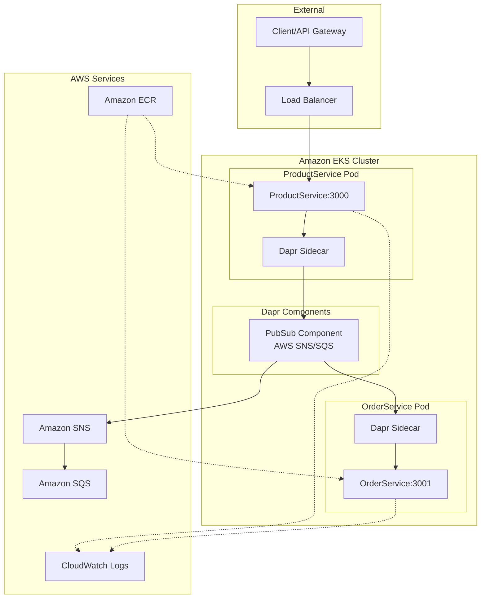

# Architecture Diagram

## Flow Description

1. **Client Request**: External client sends HTTP POST to ProductService via LoadBalancer
2. **Event Publishing**: ProductService publishes product event via Dapr sidecar to SNS/SQS
3. **Event Consumption**: OrderService receives event via Dapr sidecar subscription
4. **Order Processing**: OrderService processes the product event and creates an order
5. **Monitoring**: All logs are sent to CloudWatch for observability

## Key Components

- **ProductService**: REST API that publishes product events
- **OrderService**: Event subscriber that processes product events
- **Dapr Sidecars**: Handle service-to-service communication and pub/sub
- **AWS SNS/SQS**: Message broker for reliable event delivery
- **EKS**: Managed Kubernetes service hosting the microservices
- **ECR**: Container registry for Docker images